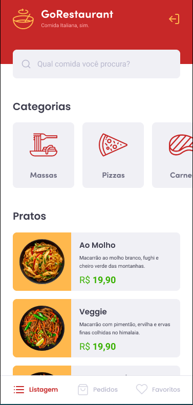
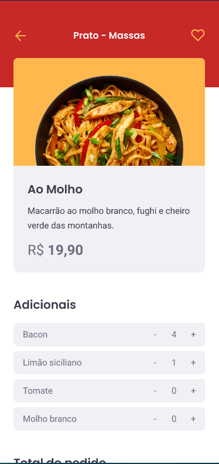

<h1 align="center">
    
</h1>

# GoRestaurant_mobile

[Desafio](https://github.com/rocketseat-education/bootcamp-gostack-desafios/tree/master/desafio-react-native-delivery) trazido pela Rocketseat, onde adquirimos uma template pré-definida e dai desenvolvemos as funcionalidades de forma que os testes passem e a aplicação se torne funcional.

<p align="center">
  
  
</p>

## Dependências

Para instalar as dependências é só você rodar: 
```
yarn
```

## Execução
Primeiramente você precisa ajustar sua baseURL em src/services/api de forma que funciona no sistema android ou ios. 
Se por acaso não você não saiba como configurar o emulador, você pode seguir este [guia](https://react-native.rocketseat.dev/).
Configurado o emulador ( ou você está usando o dispositivo físico ), você pode rodar a fake api pelo script 'dev', com:

```
yarn dev
```

E para rodar a aplicação em si:
```
yarn android  //para dispositivos androids
ou
yarn ios  //para dispositivos ios
```

Depois disso, com a aplicação instalada, pode-se usar:
```
yarn start
```

Testes podem ser realizados com:
```
yarn test
```
